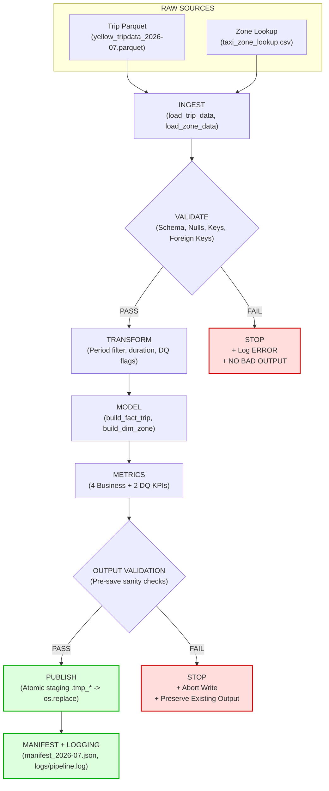

# Pipeline Architecture Specification

## 1. System Overview

The **NYC Taxi Operations Intelligence Pipeline** is an end-to-end, trustworthy, production-grade data engineering pipeline. It transforms raw NYC Taxi and Limousine Commission (TLC) trip data into validated relational analytical models and operational KPIs, publishing versioned, partitioned datasets with atomic guarantees.

---

## 2. End-to-End Workflow Diagram



### Text Flow Representation:

```text
                 RAW SOURCES
                     │
            ┌────────┴────────┐
            │                 │
            ▼                 ▼
       Trip Parquet      Zone Lookup
            │                 │
            └────────┬────────┘
                     │
                     ▼
                  INGEST
                     │
                     ▼
                 VALIDATE
                     │
              ┌──────┴──────┐
              │             │
            PASS          FAIL
              │             │
              ▼             ▼
          TRANSFORM       STOP
              │          + LOG ERROR
              ▼          + NO BAD OUTPUT
            MODEL
              │
              ▼
           METRICS
              │
              ▼
      OUTPUT VALIDATION
              │
          ┌───┴───┐
          │       │
        PASS     FAIL
          │       │
          ▼       ▼
       PUBLISH   STOP
          │
          ▼
   MANIFEST + LOGGING
```

### Core Data Engineering Architecture Principle: Fail-Stop Validation Gates

The architectural flow enforces a foundational data engineering rule: **Validation gates protect downstream stages**.
- If incoming raw data suffers schema drift, missing mandatory columns (e.g. absent `trip_distance`), invalid data types, or violated referential integrity, the pipeline halts immediately at the validation gate.
- Critical validation failures **never** reach transformation, relational modeling, metric calculation, or destination publication paths.
- No partial or corrupted files are written to `data/processed/`, and any previously published valid datasets remain 100% intact and untouched.

---

## 3. Pipeline Stages & Responsibilities

| Stage | Module | Primary Responsibility | Input Data | Output Entity |
|---|---|---|---|---|
| **1. Ingest** | `src/ingest.py` | Load raw Parquet trips and CSV zones with type inference and file validation. | File paths from config | Raw DataFrames (`3,530,109` trips, `265` zones) |
| **2. Validate** | `src/validate.py` | Enforce 6 structural and referential data quality gates. Fail fast on contract breaches. | Raw DataFrames | `ValidationResult` (Passed/Failed, errors, warnings) |
| **3. Transform** | `src/transform.py` | Filter reporting month boundaries, calculate trip duration in minutes, compute boolean quality flags. | Validated DataFrames | Transformed DataFrame (`3,530,063` rows) |
| **4. Model** | `src/model.py` | Construct conformed dimensional entities: generate surrogate keys, project analytical schemas. | Transformed DataFrame | `fact_trip`, `dim_zone` |
| **5. Metrics** | `src/metrics.py` | Compute 4 Business KPIs and 2 Data Quality KPIs with exact mathematical logic. | `fact_trip`, `dim_zone` | List of `MetricResult` and metrics DataFrame |
| **6. Publish** | `src/output.py` | Pre-save sanity validation, write to temporary staging files, and commit via atomic swap. | Models, Metrics, Config | Partitioned Parquet, CSV, Manifest JSON |
| **7. Logging** | `src/logger.py` | Structured dual-destination logging (console + file trace) with stage durations. | Pipeline events | `logs/pipeline.log` |

---

## 4. Atomic Staging & Publication Architecture

Outputs are **never** written directly into target production paths. Direct writes risk partial files, corrupted headers, or inconsistent tables being observed by downstream consumers.

### Staging Protocol:
1. For each artifact (`fact_trip`, `dim_zone`, `metrics`, `manifest`), the engine creates a unique temporary staging file in the target directory (e.g. `.tmp_fact_trip_2026-07_<uuid>.parquet`).
2. Data is completely written and verified for non-empty bytes on disk.
3. The staging file is committed to the final destination via `os.replace()`:
   ```python
   # Atomic POSIX replacement ensures zero partial reads
   os.replace(staging_path, final_destination_path)
   ```
4. If an exception occurs at any point during writing, the staging file is unlinked immediately and the target destination remains unaltered.

---

## 5. Strict Idempotency Architecture

An execution is **idempotent** if running it multiple times produces the exact same state as running it once, without duplicate records, data corruption, or side effects:

$$\text{Pipeline}(\text{Input}, \text{Period}) = \text{Output}$$
$$\text{Pipeline}(\text{Pipeline}(\text{Input}, \text{Period})) = \text{Output}$$

### Idempotency Mechanics:
- **Logical Partition Key**: Every output path includes the logical month partition (`YYYY-MM`). Re-running the pipeline targets the exact same partition paths.
- **No Append Side-Effects**: Parquet and CSV files are completely replaced atomically, ensuring row counts never double upon rerun (`fact_trip` remains exactly `3,530,063` rows).
- **Bitwise Determinism**: Logical content hashing using SHA-256 over sorted primary keys guarantees that rerun output is bitwise identical across executions.

---

## 6. Execution Logging & Manifest Tracking

### Structured Dual Logging:
- **Console Stream**: Formatted, human-readable status, warnings, and summary metrics.
- **File Stream (`logs/pipeline.log`)**: Comprehensive timestamped execution traces with stage boundaries and elapsed durations.

### Run Manifest (`data/processed/manifest_2026-07.json`):
Every successful run atomically generates a run manifest recording:
- Pipeline status (`success`)
- Execution timestamp (`generated_at`)
- Reporting period (`2026-07`)
- Ingestion counts and source paths
- Output file paths, row counts, and column schemas
- Logical content SHA-256 fingerprints
- Stage-by-stage elapsed execution times
