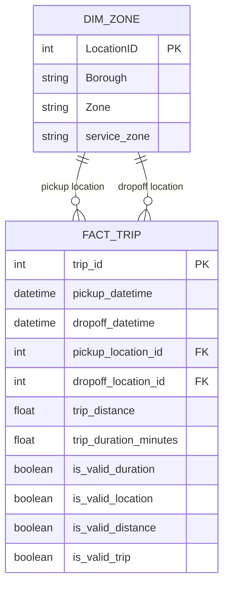

# Data Model & Transformation Specification

## 1. Overview & Data Flow

The transformation and dimensional modeling layers consume validated raw Parquet trip data and CSV taxi zone references, filter reporting boundaries, derive analytical metrics and quality flags, and construct conformed star-schema relational entities.

```text
       raw_trips (3,530,109 rows)          raw_zones (265 rows)
                   │                                │
                   ▼                                │
         transform_trip_data                        │
        (boundary filter, duration,                 │
         boolean DQ flags)                          │
                   │                                │
                   ▼                                ▼
       transformed_trips (3,530,063)         dim_zone (265 rows)
                   │                                ▲
                   ▼                                │
            build_fact_trip ────────────────────────┘
            (surrogate key, column projection)
                   │
                   ▼
          fact_trip (3,530,063 rows)
```

### Relational Entity-Relationship Diagram (Mermaid)



---

## 2. Reporting Period Filtering Logic

- **Reporting Period**: **July 2026** (`2026-07-01 00:00:00 <= tpep_pickup_datetime < 2026-08-01 00:00:00`).
- **Initiation Principle**: A trip belongs to the reporting period based strictly on when it was initiated (`tpep_pickup_datetime`).
- **Boundary Handling**: Trips starting late on July 31 and completing on August 1 remain valid July trips; `tpep_dropoff_datetime` is intentionally not filtered by month boundary.
- **Raw Retention**: The 46 trips with pickup timestamps outside July (Dec 2008: 1, June 2026: 7, August 2026: 38) are retained in `data/raw/` for auditability and excluded from `fact_trip`.

---

## 3. Operational Feature Derivation

### Trip Duration
- **Formula**:
  $$\text{trip\_duration\_minutes} = \frac{\text{tpep\_dropoff\_datetime} - \text{tpep\_pickup\_datetime}}{60\text{ seconds}}$$
- **Precision**: Preserved as float64 with microsecond resolution.
- **Anomalies**: Trips with dropoff occurring prior to pickup result in negative duration values and are captured by data quality flags.

---

## 4. Record-Level Data Quality Flags

Rather than silently dropping anomalous records, the pipeline flags records across four boolean attributes:

| Flag Column | Evaluation Condition | Valid Count (July 2026) | Invalid Count | Operational Treatment |
|---|---|---:|---:|---|
| `is_valid_duration` | `dropoff_datetime >= pickup_datetime` | 3,530,062 | 1 | Preserved in fact table; excluded from duration averages. |
| `is_valid_location` | `PULocationID` & `DOLocationID` in `dim_zone` | 3,530,063 | 0 | Checked against all 265 TLC zone keys. |
| `is_valid_distance` | `trip_distance >= 0` and non-null | 3,530,063 | 0 | Non-negative physical distance rule. |
| `is_valid_trip` | `is_valid_duration & is_valid_location & is_valid_distance` | 3,530,062 | 1 | Master composite quality indicator. |

### Anomaly Preservation Rationale
The single inverted-chronology record (`pickup = 22:24:27`, `dropoff = 22:24:17`, `duration = -0.1667 min`) is preserved in `fact_trip` with `is_valid_duration = False`. It is **not** deleted, zeroed out, or artificially modified. Downstream metric calculations explicitly filter `is_valid_duration == True`, guaranteeing transparent auditability.

---

## 5. Dimensional Entities

### Dimension: `dim_zone`
- **Grain**: One row per taxi zone.
- **Row Count**: 265 rows.
- **Storage**: `data/processed/dim_zone/dim_zone_2026-07.parquet`

| Column | Data Type | Nullable | Description |
|---|---|---|---|
| `LocationID` | int64 | No | Primary Key (1–265). |
| `Borough` | string | No | NYC Borough (e.g. Manhattan, Queens, Brooklyn). |
| `Zone` | string | No | Specific zone name (e.g. JFK Airport, Midtown Center). |
| `service_zone` | string | Yes | Administrative zone grouping (e.g. Yellow Zone, Airports). |

### Fact: `fact_trip`
- **Grain**: One row per completed taxi trip initiated in July 2026.
- **Row Count**: 3,530,063 rows.
- **Storage**: `data/processed/fact_trip/fact_trip_2026-07.parquet`

| Column | Data Type | Nullable | Description |
|---|---|---|---|
| `trip_id` | int64 | No | Primary Surrogate Key (1 to 3,530,063). |
| `pickup_datetime` | timestamp[us] | No | Trip start timestamp. |
| `dropoff_datetime` | timestamp[us] | No | Trip completion timestamp. |
| `pickup_location_id` | int64 | No | Foreign Key referencing `dim_zone.LocationID`. |
| `dropoff_location_id` | int64 | No | Foreign Key referencing `dim_zone.LocationID`. |
| `trip_distance` | float64 | No | Recorded trip distance in miles. |
| `trip_duration_minutes` | float64 | No | Derived duration in minutes. |
| `is_valid_duration` | bool | No | True if dropoff >= pickup. |
| `is_valid_location` | bool | No | True if pickup and dropoff match `dim_zone`. |
| `is_valid_distance` | bool | No | True if trip_distance >= 0. |
| `is_valid_trip` | bool | No | True if all quality criteria pass. |

---

## 6. Referential Integrity

Both `pickup_location_id` and `dropoff_location_id` are validated against `dim_zone.LocationID`:
- Unmatched pickup location IDs: **0**
- Unmatched dropoff location IDs: **0**
- Orphan records: **0**

---

## 7. Model Boundaries & Explicit Exclusions

The following operational concepts are not present in the raw TLC Yellow Taxi records and are intentionally not modeled:
- Drivers, medallions, and employee IDs
- Vehicle telemetry, engine diagnostics, and GPS routes
- Passenger identities, party size demographics, or payment personal details
- Unfulfilled or cancelled trip requests
